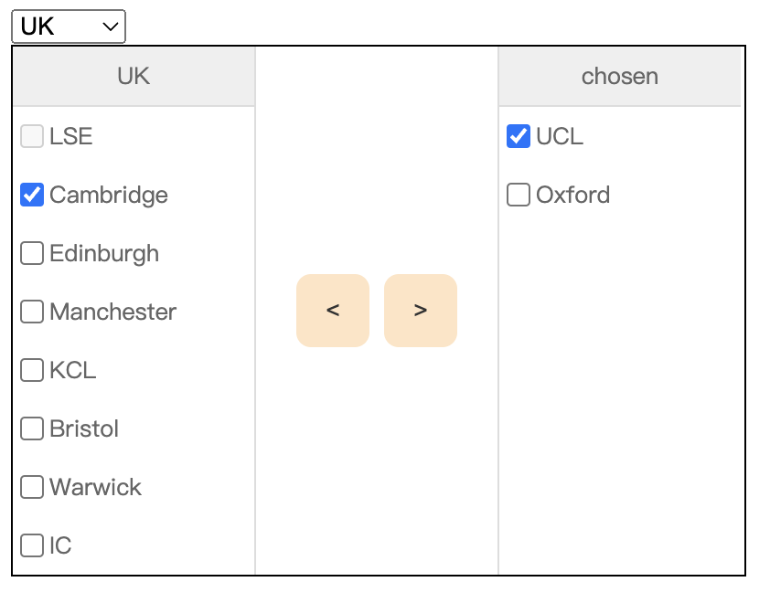
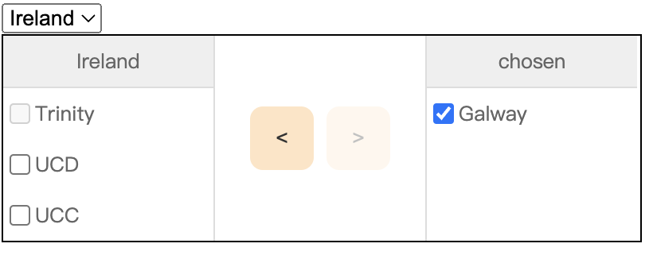
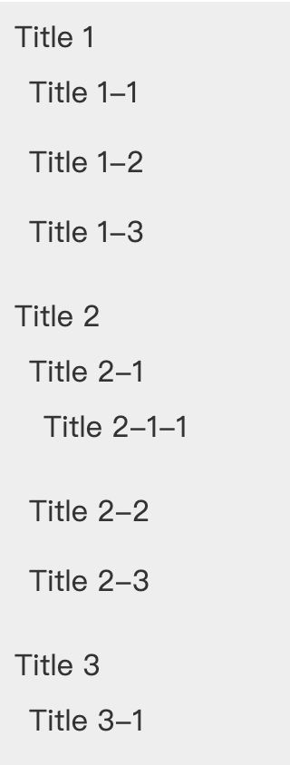

# Common UI components encapsulation

## Project structure

All the encapsulated UI components are in the /packages folder, and it will export to the global Vue with install function and app.component

## Components

### Tranfer

Ref to [Tranfer ElementUI](https://element.eleme.cn/#/zh-CN/component/transfer#events). The basis idea is to define the right side data as the base data, the left side data is the reduction between the overall data and right side data. With the powerful VUE3 hooks, we can encapsulated all the data and logic part to the hooks, and make the whole components more simple.

- select - options box: To change the country name
- rightListData: the right side data, default value is empty array.
- leftListData: the left side data, the reduction part between list data and right list data.
- activeLeftItems and activeRightItems: the checked items in left and right side.

Params:

- Data: pls see the example in mock folder
- right title: Title for the right side data box

example:

### Carousel

How to realize carousel in Native Javascript: add the first pictures at last (one, two, three, one...)
How to realize carousel with Vue component: dynamic component or v-if (?). All the carousel images are in the same position (position: absolute), every time to alternate the previous shown component. Sounds fine !

- Very important API: getCurrentInstance(), because the props cannot be accessed in slot.

### Magnifier

Create two images, one is static image and one is magnifier. Use Position relative and position absolute to define the hierarchies. Then use the custom directives to control the DOM operations. mouseover, mousemove and x, y changing.

### Rating

Use the custom directives to build rating bar, listen on the mouse moving and bind the rating number to the directive.

### Tree

Use the tree data structure and recursive components to realize the multi-layer components

